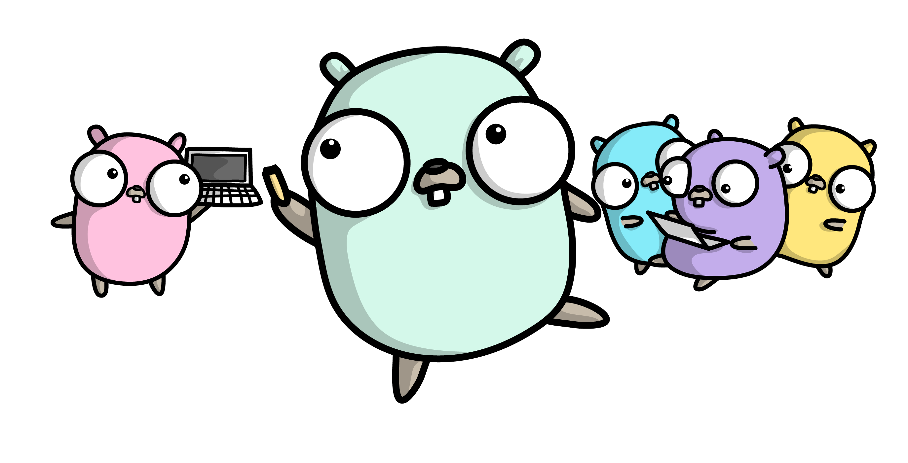

# go-learn-go
If it helped me learn GoLang this is where it is

## What is this?

This repository is a collection of tutoiral projects that are set up in the following fashion:

- Each primary entity is a folder
  - Example: If I read a book entitled: GoLang Cookbook there would be a root level entry entitled: `golang-cookbook`. `golang-cookbook` would be refered to as a primary entity in the context of this README.
- Each primary entity will contain a README and a collection of project folders
  - The README at the top of the primary entity folder will describe what the project is dealing with and how a user ought to go about uinteracting with the project(s) housed there.
  - The projects will always be runnable GoLang applications unless otherwise stated and explained.

## Why make this?

To learn GoLang

## How does I use this?

- `git clone <this-repo> # To your $GOPATH`
- `cd <this-repo>/project/of/interest`
- `go run [*].go`
