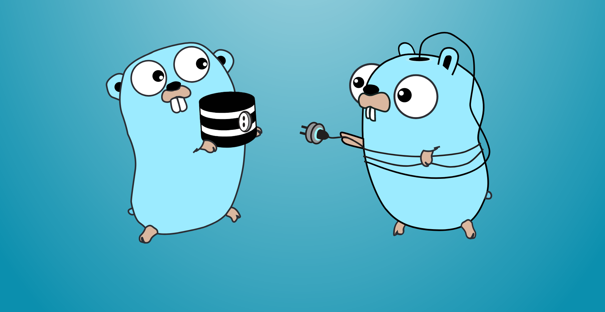

# golang-db-book

## What is this?

This repo is a collection of simple ways to interact with a database using GoLang. It is mostly a collection of hand copied examples from "The Ultimate Guide To Building Database - Driven Apps with Go" by the fine folks at [Vivid Cortex](https://www.vividcortex.com/resources/topic/ebooks)

## Why make this? 

To provide myself with simple example of how to interacts with a SQL database in GoLang

## Resources:
https://itjumpstart.files.wordpress.com/2015/03/database-driven-apps-with-go.pdf
